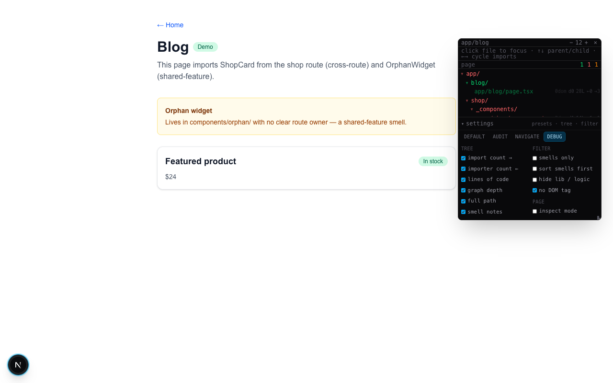

# @nathanham16/route-lens

**Route Lens** is a dev-only overlay for Next.js App Router that shows what the current page imports, colored by colocation (green / red / orange).

Not affiliated with Vercel or the Next.js project.

## Why use it

- **See coupling at a glance** — every `.tsx` the page pulls in, grouped in a draggable import tree.
- **Spot colocation smells** — red means another route tree; orange means shared `components/` that may need a single owner.
- **Inspect in the browser** — click a file to focus its subtree, or use inspect mode to highlight components on the page.
- **Works in CI and scripts** — the same audit engine powers the overlay, CLI, and programmatic API.

## Install

```bash
npm install -D @nathanham16/route-lens
```

## Quick start

### 1. API route

Create `app/api/dev/route-lens/route.ts`:

```ts
import { createRouteLensHandler } from '@nathanham16/route-lens/next';

export const GET = createRouteLensHandler();
```

Optional config (shared paths, `_product` sibling routes):

```ts
export const GET = createRouteLensHandler({
  okPrefixes: ['components/ui/', 'lib/', 'components/copilot/'],
  productSibling: true, // app/foo/[id] + app/foo/_product/
});
```

The handler returns **404 outside development** and accepts either `?route=submissions/[id]` or `?pathname=/submissions/abc`.

### 2. Widget

Mount in your root client providers (dev only):

```tsx
'use client';

import { RouteLens } from '@nathanham16/route-lens/react';

export function Providers({ children }: { children: React.ReactNode }) {
  return (
    <>
      {process.env.NODE_ENV === 'development' && <RouteLens />}
      {children}
    </>
  );
}
```

If your API route is not at the default path, pass `apiPath`:

```tsx
<RouteLens apiPath="/api/dev/route-lens" />
```

### 3. Use it

1. Run your Next.js dev server.
2. Navigate to any App Router page.
3. Click the folder-tree widget (bottom-left) or press `Alt+Shift+C` to open the panel.
4. Drag to move, resize from the bottom-right corner. Expand **settings** for presets and tree badges.

| Shortcut | Action |
|----------|--------|
| `Alt+Shift+C` | Toggle panel |
| `↑` / `↓` | Jump to parent / child in import graph |
| `←` / `→` | Cycle multiple imports |
| `⇧←` / `⇧→` | Cycle multiple parents |

**Settings presets:** `default` · `audit` (smells only) · `navigate` (import counts + depth) · `debug` (all badges).

## Visual tour

Screenshots from the [colocation demo app](https://github.com/NathanHam16/route-lens/tree/main/examples/colocation-demo) running on `/blog` — a page that imports `ShopCard` from another route (red) and `OrphanWidget` from `components/orphan/` (orange).

### Widget on the page

Bottom-left folder-tree button opens the panel. Press `Alt+Shift+C` from anywhere.


### File tree

Color-coded import tree: green = colocated, red = cross-route, orange = shared-feature smell.


### Settings — debug preset

All badges: `→N` imports, `←N` importers, `142L` lines, `d4` graph depth, `0dom` not mounted.



### Audit preset

Smells only, sorted first, inline smell notes on suspects.


### Focus + graph navigation

Click a file to focus. Parent/child jump bar at top. Filter toggles lock while focused (full downstream tree).


### Inspect mode

Hover any DOM node → floating badge with file path and bucket. Click to focus in tree.


### Navigate preset

Import/importer counts and graph depth for walking the import graph.


## CLI

Audit a route or page file from the terminal:

```bash
npx @nathanham16/route-lens submissions/[id]
npx @nathanham16/route-lens app/foo/page.tsx
npx @nathanham16/route-lens submissions/[id] --json
npx @nathanham16/route-lens submissions/[id] --suspects-only
```

| Flag | Effect |
|------|--------|
| `--json` | Print full audit result as JSON |
| `--suspects-only` | List only cross-route, shared-feature, and other smells |

## Color legend

| Color | Bucket | Meaning |
|-------|--------|---------|
| Green | `colocated` | Under the same route folder as `page.tsx` |
| Green | `product` | Under a `_product/` sibling (when `productSibling: true`) |
| Gray | `shared` | Known shared paths (`lib/`, `components/ui/`, etc.) — hidden by default |
| Orange | `shared-feature` | `components/...` used here — does it have a single owner? |
| Red | `cross-route` | Another `app/...` route tree |
| Orange | `other` | Everything else worth reviewing |

## API reference

Three entry points:

| Import | Use for |
|--------|---------|
| `@nathanham16/route-lens` | Core audit engine, classifiers, import graph |
| `@nathanham16/route-lens/next` | Next.js API route handler |
| `@nathanham16/route-lens/react` | Browser overlay widget |

### `@nathanham16/route-lens`

**Audit**

| Export | Description |
|--------|-------------|
| `auditPage(entry, config?)` | Walk imports from a route (`submissions/[id]`) or file path; returns `PageAuditResult` |
| `PageAuditResult` | `{ entry, routeRoot, totalFiles, tsxComponents, counts, suspects, edges, all }` |

**Classification**

| Export | Description |
|--------|-------------|
| `createClassifier(config)` | Build `{ classify, smellNote }` from resolved config |
| `classify(rel, routeRoot)` | Default classifier — bucket for a src-relative path |
| `smellNote(rel, bucket, routeRoot)` | Human-readable note for suspect buckets |
| `routeRootFromEntry(entryRel)` | `app/foo/[id]/page.tsx` → `app/foo/[id]` |
| `featureSiblingPrefix(routeRoot)` | `app/foo/[id]` → `app/foo/_product/` |
| `AuditBucket` | `'colocated' \| 'product' \| 'shared' \| 'shared-feature' \| 'cross-route' \| 'other' \| 'logic'` |
| `AuditRow` | `{ file, component, bucket, note }` |

**Config**

| Export | Description |
|--------|-------------|
| `ColocationConfig` | `{ rootDir?, srcDir?, alias?, okPrefixes?, productSibling? }` |
| `ResolvedColocationConfig` | Config with absolute paths resolved |
| `resolveConfig(config?)` | Merge user config with defaults |
| `DEFAULT_OK_PREFIXES` | Built-in shared paths (`lib/`, `components/ui/`, …) |

**Import graph**

| Export | Description |
|--------|-------------|
| `buildImportIndex(edges)` | `{ importsOf, importedBy }` maps |
| `importSubtree(file, importsOf)` | All files reachable from a root |
| `importersOf(file, importedBy)` | Direct importers of a file |
| `formatImporterSummary(file, importers, entryFile?, max?)` | One-line hover label |
| `fileBasename(file)` | Last path segment |
| `ImportEdge` | `{ from, to }` |

**Tree UI helpers**

| Export | Description |
|--------|-------------|
| `buildFileTree(rows)` | Nest audit rows into a directory tree |
| `dominantBucket(node)` | Worst bucket under a folder (for tinting) |
| `FileTreeNode` | `{ name, path, children, row? }` |

### `@nathanham16/route-lens/next`

| Export | Description |
|--------|-------------|
| `createRouteLensHandler(options?)` | Returns a `GET` handler for your API route |
| `pathnameToRoute(pathname, config)` | `/submissions/uuid` → `submissions/[id]` |
| `listRouteChildren(dir)` | List routable child folders (flattens route groups) |
| `CreateColocationRouteOptions` | Alias for `ColocationConfig` |

### `@nathanham16/route-lens/react`

| Export | Description |
|--------|-------------|
| `RouteLens` | Dev overlay widget (client component) |
| `RouteLensProps` | `{ apiPath? }` |
| `usePageAudit(pathname, options?)` | Fetch audit data for a pathname |
| `UsePageAuditOptions` | `{ apiPath? }` |

Deprecated aliases (`NextColocationWidget`, `ColocationDevTools`, `createColocationRouteHandler`) remain for backward compatibility.

## Requirements

| Dependency | Version |
|------------|---------|
| Node.js | **≥ 22** |
| Next.js | **≥ 14** (App Router) |
| React | **≥ 18** |
| React DOM | **≥ 18** |

Install as a **dev dependency** — Route Lens is not intended for production bundles.

## Stability

**v0.1.0** is an early release. APIs, default classification rules, and overlay UX may change in minor versions. Pin the version and read release notes before upgrading.

## Bug reports

Open an issue: [github.com/NathanHam16/route-lens/issues](https://github.com/NathanHam16/route-lens/issues)

Include your Next.js version, a route path, and (if relevant) your `createRouteLensHandler` config.

## Security

Report vulnerabilities via [SECURITY.md](https://github.com/NathanHam16/route-lens/blob/main/SECURITY.md).

## License

[MIT](LICENSE)
