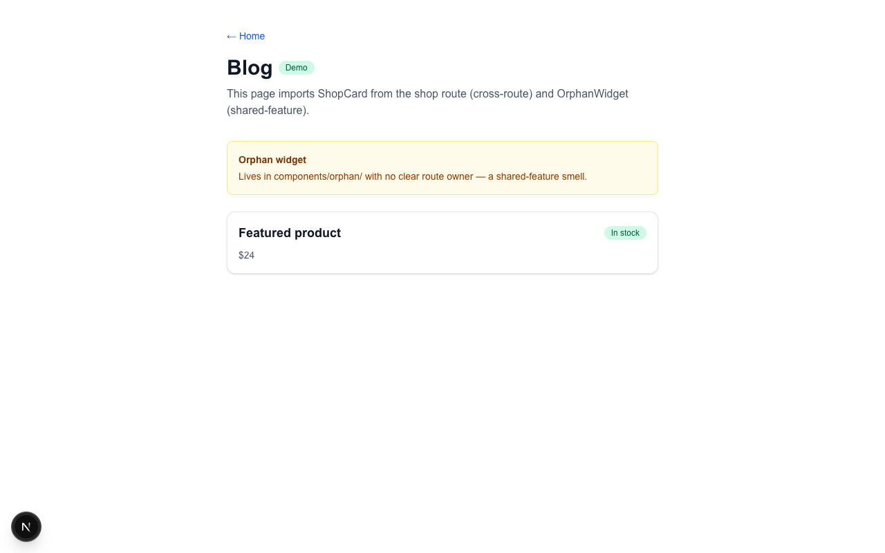

# @nathanham16/route-lens

Dev-only overlay for **Next.js App Router**. Shows what the current page imports, colored by colocation.

| Color | Meaning |
|-------|---------|
| Green | Under this route (or `_product/` sibling) |
| Red | Another `app/` route tree |
| Orange | Shared `components/` — unclear owner |

**v0.2.6** · Node ≥ 22 · Next ≥ 14 · React ≥ 18 · devDependency only

## Install

```bash
npm install -D @nathanham16/route-lens
```

**Using a coding agent?** Copy [docs/AGENT-INSTALL.md](./docs/AGENT-INSTALL.md) into Cursor / Claude Code / Codex.

## Setup (3 files)

**1. API route** — `app/api/dev/route-lens/route.ts`

```ts
import { notFound } from 'next/navigation';
import { createRouteLensHandler } from '@nathanham16/route-lens/next';

const handler = createRouteLensHandler();

export async function GET(req: Request): Promise<Response> {
  if (process.env.NODE_ENV !== 'development') notFound();
  return handler(req);
}
```

**2. Widget** — root client providers

```tsx
import dynamic from 'next/dynamic';

const RouteLens =
  process.env.NODE_ENV === 'development'
    ? dynamic(
        () =>
          import('@nathanham16/route-lens/react').then(async (m) => {
            await import('@nathanham16/route-lens/react/styles.css');
            return m.RouteLens;
          }),
        { ssr: false },
      )
    : () => null;

// {process.env.NODE_ENV === 'development' && <RouteLens />}
```

**3. `next.config`** — add `transpilePackages: ['@nathanham16/route-lens']`.

If auth middleware blocks the API route in dev, bypass `/api/dev/route-lens` when `NODE_ENV === 'development'`.

Optional handler config: `okPrefixes: ['lib/', 'components/ui/']`, `productSibling: true`.

## Use it

1. `npm run dev`
2. Open any App Router page
3. Click the bottom-left widget or press **`Alt+Shift+C`**

| Key | Action |
|-----|--------|
| `Alt+Shift+C` | Toggle panel |
| `I` | Inspect mode (hover page → see source file) |
| `↑` / `↓` | Parent / child in import graph |

Panel **settings** → presets: `default` · `audit` · `navigate` · `debug`.

## CLI

```bash
npx route-lens blog
npx route-lens submissions/[id] --suspects-only --json
```

## Screenshots

From [`examples/colocation-demo`](./examples/colocation-demo) on `/blog` (cross-route + shared-feature smells):




## Demo app

```bash
cd examples/colocation-demo && npm install && npm run dev
```

Open http://localhost:3000/blog · `Alt+Shift+C`

## Links

- [Changelog](./CHANGELOG.md)
- [Agent install prompt](./docs/AGENT-INSTALL.md)
- [Examples](./examples/)
- [Issues](https://github.com/NathanHam16/route-lens/issues)

MIT
