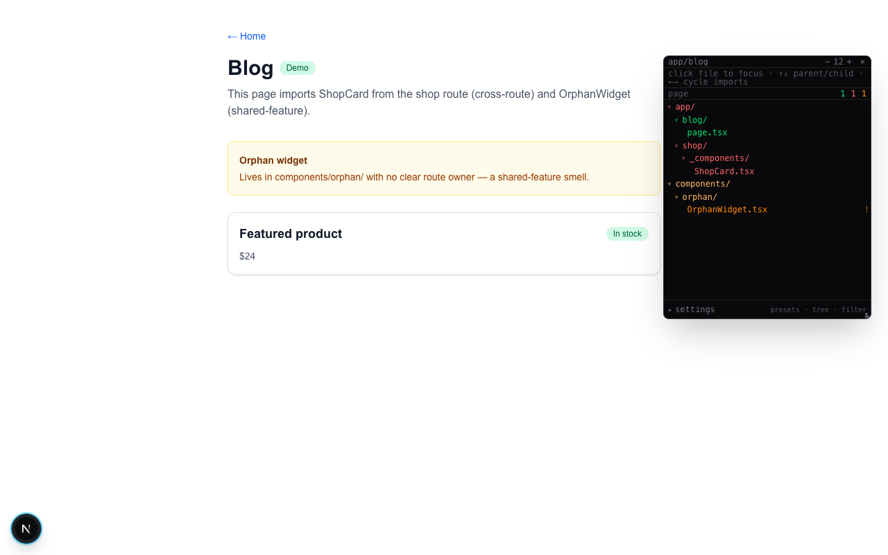
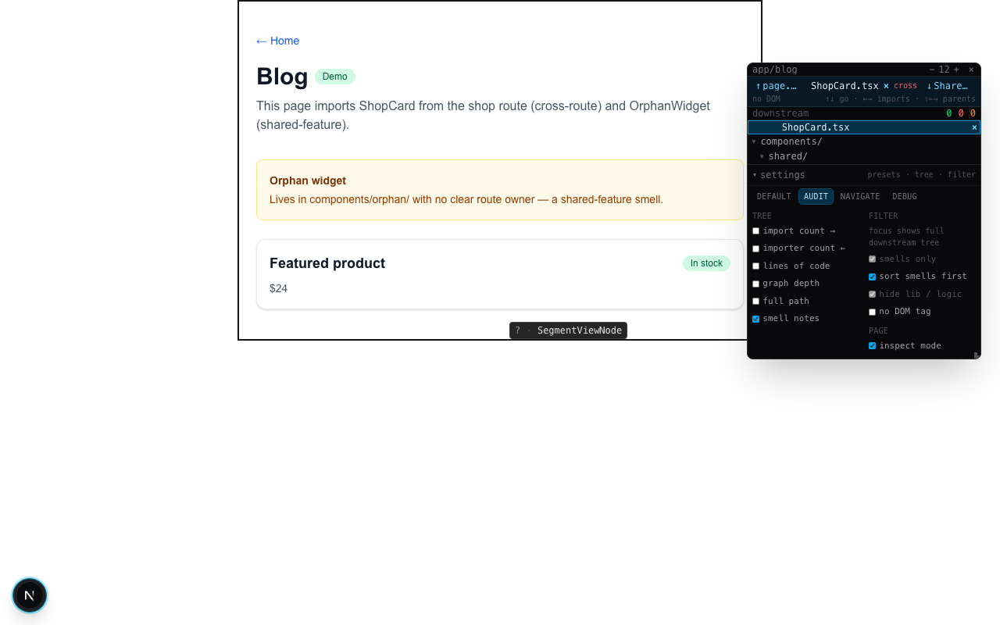
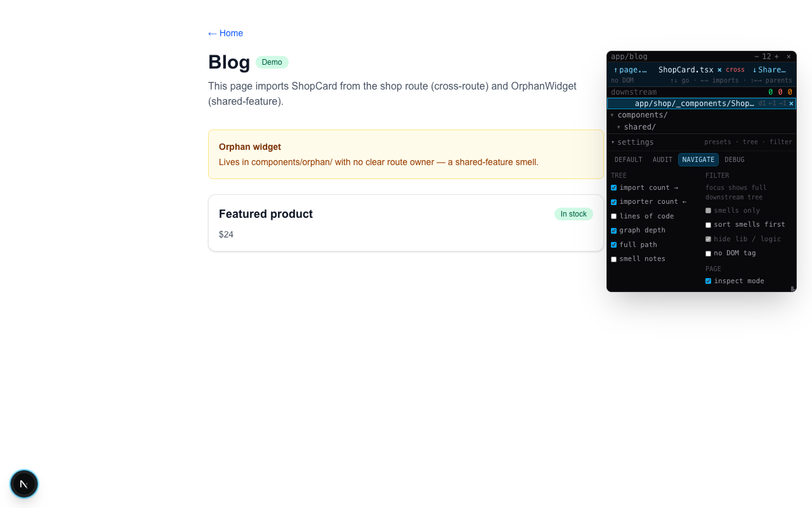

# Colocation dev overlay

Dev-only overlay for Next.js App Router: static import audit + runtime mount detection + click-to-focus navigation. Answers **“which files render on this page, and which ones smell wrong?”**

Runs only when `NODE_ENV === 'development'`.

## Quick start (this demo app)

```bash
cd colocation-demo
npm install
npm run dev          # http://localhost:3000
```

Open **`/blog`** — it deliberately imports `ShopCard` from `/shop` (cross-route) and `OrphanWidget` from `components/orphan/` (shared-feature smell).

| Shortcut | Action |
|----------|--------|
| `Alt+Shift+C` | Toggle overlay panel |
| Click widget | Same (bottom-left, snaps to edges) |
| Click tree row | Focus file — sky highlight + page bbox |
| `↑` / `↓` | Jump to parent / child in import graph |
| `←` / `→` | Cycle multiple imports |
| `⇧←` / `⇧→` | Cycle multiple parents |

CLI audit (no browser):

```bash
npm run page:audit -- blog
npm run page:audit -- blog --json
```

## Bucket colors

| Color | Bucket | Meaning |
|-------|--------|---------|
| Green | `colocated`, `product` | Lives under this route or its `_product/` sibling |
| Red | `cross-route` | Another `app/` route’s component on this page |
| Orange | `shared-feature`, `other` | Feature component with unclear single owner |
| Grey | `shared`, `logic` | Global OK (`components/ui/`, `lib/`, etc.) or `.ts` logic |

Header counts: **green** ok · **red** cross-route · **orange** audit smells.

## Screenshots

### 1. Widget + file tree

Open the panel on `/blog`. Tree is color-coded; suspects stand out immediately.



### 2. Settings — debug preset

Expand **settings** at the bottom. **debug** turns on all badges: import counts, LOC, graph depth, no-DOM tag.


### 3. Audit preset

**audit** filters to smells only, sorts them first, shows inline smell notes.


### 4. Focus + import graph nav

Click a suspect (e.g. `ShopCard.tsx`). Focus bar shows parent (`page.tsx`) and child imports. Page boxes the mounted subtree when possible.


### 5. Inspect mode

Enable **inspect mode** in settings. Hover any DOM node → floating badge with file path and bucket. Click to focus in tree.



### 6. Navigate preset

**navigate** shows import/importer counts and graph depth for walking the tree.



## Settings reference

| Section | Toggles |
|---------|---------|
| **Presets** | `default` · `audit` · `navigate` · `debug` |
| **Tree** | import count →, importer count ←, LOC, graph depth, full path, smell notes |
| **Filter** | smells only, sort smells first, hide lib/logic, no DOM tag |
| **Page** | inspect mode |

Presets persist in `sessionStorage` (`edexia-colocation-panel-settings`).

## Architecture

```
scripts/page-audit.mjs     static import walk + bucket classify
        ↓
/api/dev/page-audit        dev-only JSON API
        ↓
usePageAudit               fetch on pathname change
        ↓
ColocationDevTools         overlay UI (tree, settings, inspect, focus)
```

Source lives in `src/dev/pageAudit/`. To port into a monorepo: copy that folder + `scripts/page-audit.mjs` + `src/app/api/dev/page-audit/route.ts`, then mount `<ColocationDevTools />` in root providers (dev only).

## Demo routes

| Route | Purpose |
|-------|---------|
| `/` | Links to demo pages |
| `/shop` | Clean colocated page (`ShopCard` under route) |
| `/blog` | **Smell demo** — cross-route + shared-feature imports |
